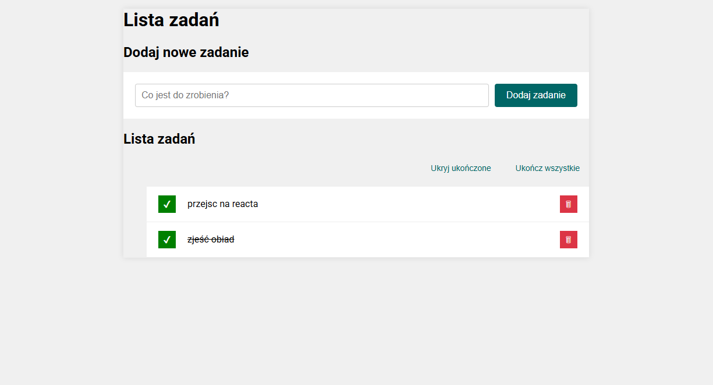

# Task List React Application

## Description

This is a modern todo list application built with React. It allows users to efficiently manage their tasks with the following features:

- Add new tasks to your list
- Mark tasks as completed/uncompleted
- Remove tasks you no longer need
- Hide/show completed tasks
- Mark all tasks as completed with one click
- Clean, responsive interface

This application demonstrates the implementation of React components, hooks (useState), and proper state management for a seamless task management experience.

# About 
You can view the live demo of the application here:
 - [Demo on GitHub Pages](https://antonis04.github.io/todo-list-react/)

